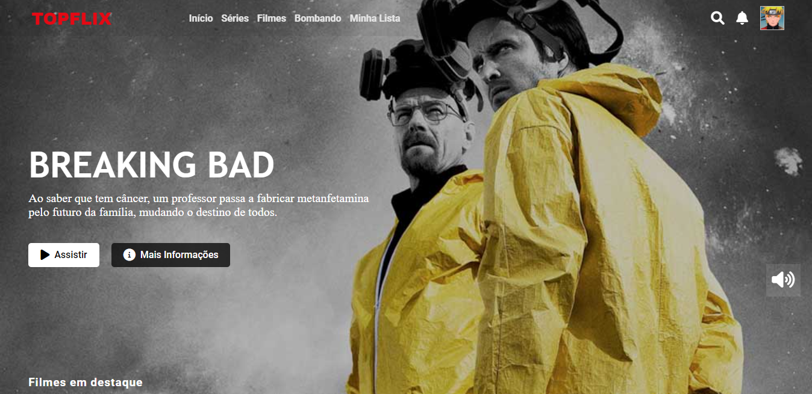
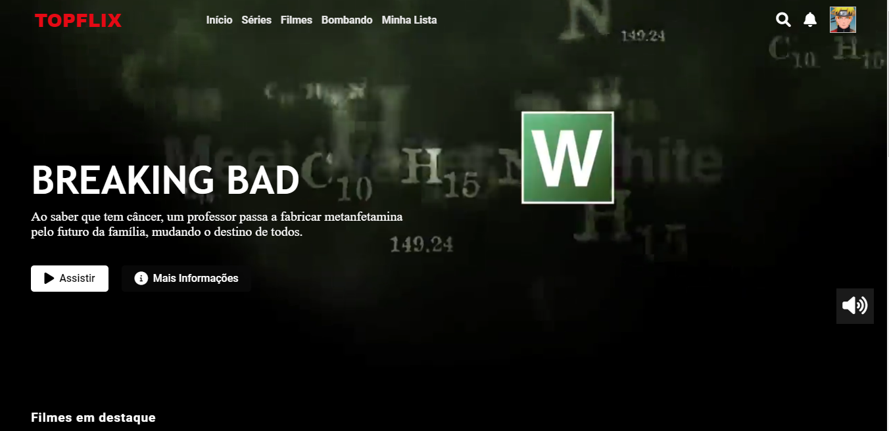
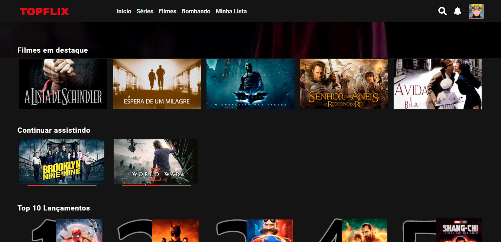
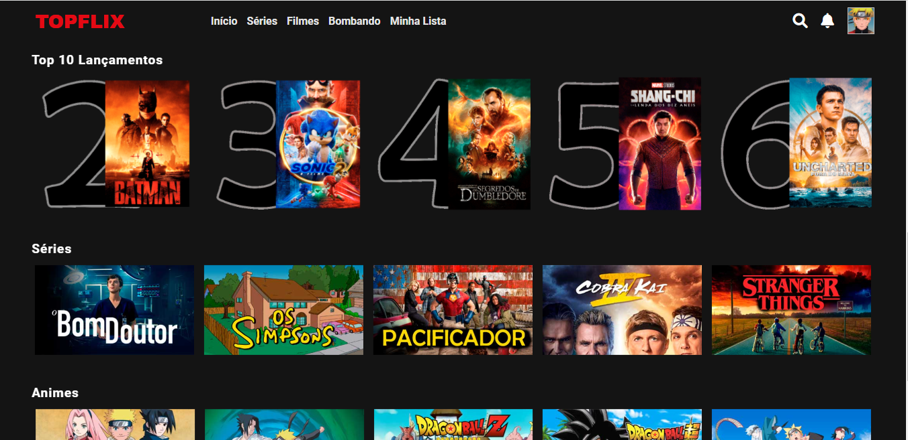
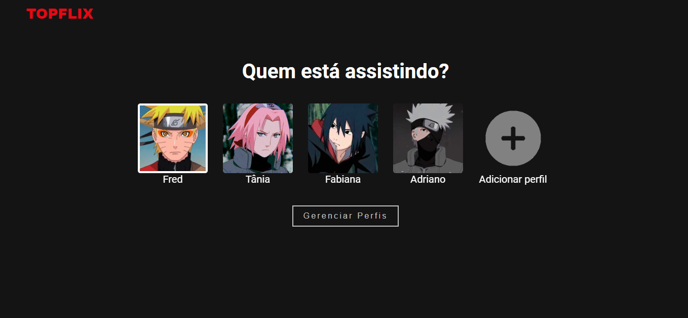

## Recriando a interface do NETFLIX

Desafio de projeto

Recriando a interface do NETFLIX para o desafio de projeto do Bootcamp Carrefour Web Developer utilizando HTML5, CSS3 e JS.

Tela inicial, header transparente e fixo no topo, ao rolar a página assume cor no plano de fundo.

Trailer da série executando no plano de fundo.

Carrossel de filmes, séries, top 10 e continuar assistindo.

Menu de perfis, acesso ao clicar no ícone do perfil no topo da página à direita.

> Instrutor: Felipe Aguiar

> Bootcamp Carrefour Web Developer