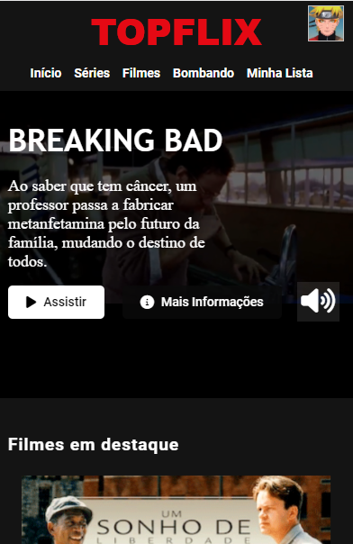
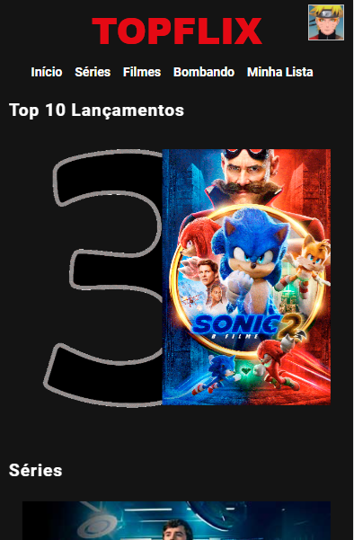
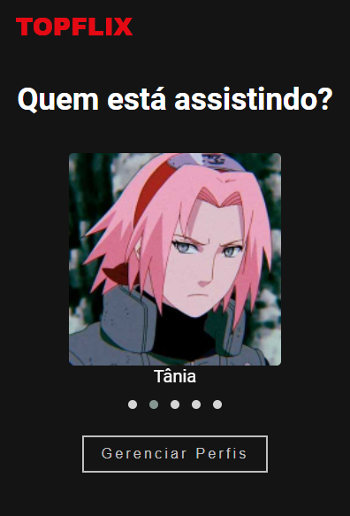
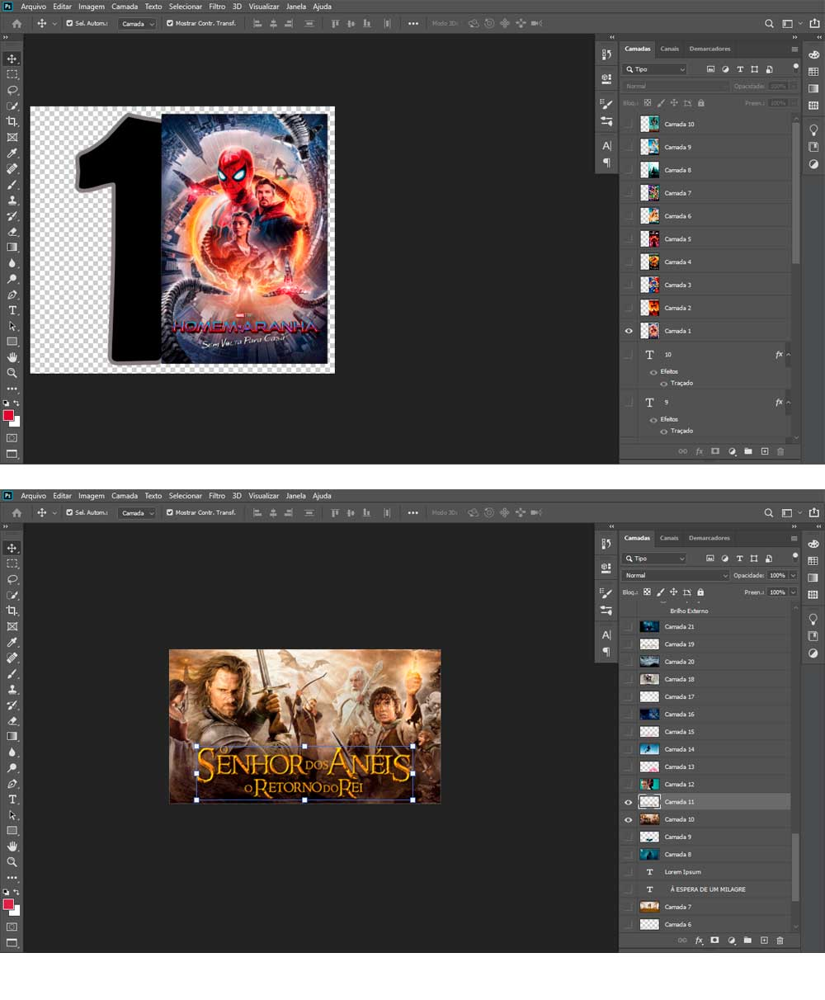
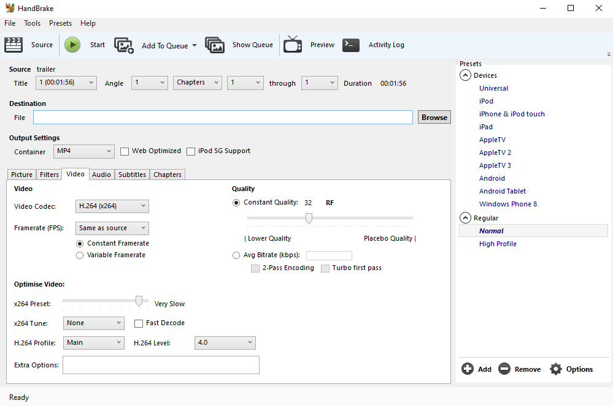

## Recriando a interface do NETFLIX

Desafio de Projeto.

Recriando a interface do NETFLIX para o desafio de projeto do Bootcamp Carrefour Web Developer da DIO, utilizando HTML5, CSS3 e JS, o Photoshop para o tratamento das imagens como os banners e miniaturas dos filmes e séries, o programa HandBrake para otimizar o tamanho do trailer incorporado no plano de fundo do título em destaque.

Tela inicial, menu transparente e fixo no topo, ao rolar a página assume cor no plano de fundo.

Trailer da série executando no plano de fundo.

Carrossel de filmes, séries, top 10 e continuar assistindo.

Menu de perfil, acesso ao clicar no ícone no topo da página à direita.

Responsividade (1000px, 700px, 480px, 380px)

Menu de perfil no modelo de carrossel. 

Tratamento de imagens.

HandBrake - Para otimizar o tamanho do trailer.

> Instrutor: Felipe Aguiar

> Bootcamp Carrefour Web Developer